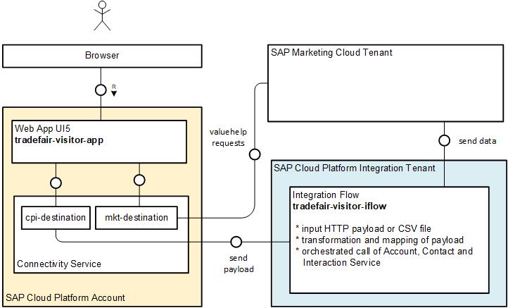

# Important Notice
This public repository is read-only and no longer maintained.

# Visitor Registration App

This app showcases an extension for SAP Marketing Cloud to provide a scenario that is not available in standard. 

The use case of this extension is the visitor data registration at a trade fair. An employee can use this app directly at the trade fair booth of his company to upload the visitors' data like contact name, contact birth date, and email together with company-related data and visit remarks to the connected SAP Marketing Cloud system.

The app was built using [SAP Marketing APIs](https://api.sap.com/package/SAPS4HANAMarketingCloud?section=Artifacts) together with the integration option of the [SAP Cloud Platform Integration](https://cloudplatform.sap.com/integration.html) and the extension options via [SAP Cloud Platform](https://cloudplatform.sap.com/).

The upload of the data happens via an integration flow (iFlow) deployed on the SAP Cloud Platform Integration tenant to a connected SAP Marketing Cloud tenant. Value help options for contact and company data from the SAP Marketing Cloud tenant are also available. 

The app can be adapted to specific needs to match similar or different business cases.

## Overview

## Prerequisite

To deploy this app successfully, you have access to the following components:
* [SAP Cloud Platform](https://help.sap.com/viewer/p/CP) account (also [trial account](https://cloudplatform.sap.com/try.html) possible)
* [SAP Cloud Platform Integration](https://help.sap.com/viewer/product/CLOUD_INTEGRATION/Cloud) account (for the iFlow)
* [SAP Marketing Cloud](https://help.sap.com/viewer/p/SAP_MARKETING_CLOUD) tenant (target system)

You need to have access to the SAP Marketing Cloud product, which is a paid product and is not available in the trial. With this you have also access to a SAP Cloud Platform Integration tenant. Check the [Onboarding Guide](https://help.sap.com/viewer/8982c0f28bca4839b563f10df1f8c259/latest/en-US) of SAP Marketing Cloud for information on how to get access to the different tenants involved.

## Installation

In a first step, [clone](https://help.github.com/articles/cloning-a-repository/) or [download](https://github.com/SAP/cloud-marketing-visitor-registration/archive/master.zip) and unzip this repository to your local machine. The repository contains all artifacts required for this scenario. 

For detailed steps of the setup and configuration of the needed components see the [Setup and Configuration Guide](SETUP.md).

## Adapting the Sample Scenario

This sample code is a fully running example. It can serve as starting point for own enhancements and changes. Different adaptations to this iFlow are possible to fit other needs than the available one.

A typical adaptation option would be adding custom fields to the app. As an example, the contact entity of SAP Marketing Cloud would have been extended with custom fields following the chapter [Custom Fields](https://help.sap.com/viewer/13d84c47bb6749a188fd53915c256516/latest/en-US/7a4a465413254133ba2ca0f806fb9006.html) in the [Extensibility Guide](https://help.sap.com/viewer/13d84c47bb6749a188fd53915c256516/latest/en-US).
For more information, see [here](ADAPT.md).

## To Do

In future this scenario might be enhanced with:
* Offline support
* Suitable Country API Service for reading countries directly from the SAP Marketing Cloud tenant
* UI app for file upload

## Support

The sample app is provided "as-is", no support is guaranteed. 

For more information, see the SCN blog [Custom App to Capture Trade Fair Contacts – Extending SAP Marketing Cloud](https://blogs.sap.com/2019/01/27/custom-app-to-capture-trade-fair-contacts-extending-sap-marketing-cloud/), where you can use the comment function to ask questions.

## License

Copyright (c) 2019 SAP SE or an SAP affiliate company. All rights reserved. This project is licensed under the SAP Sample Code License except as noted otherwise in the [LICENSE](LICENSE.md) file.
